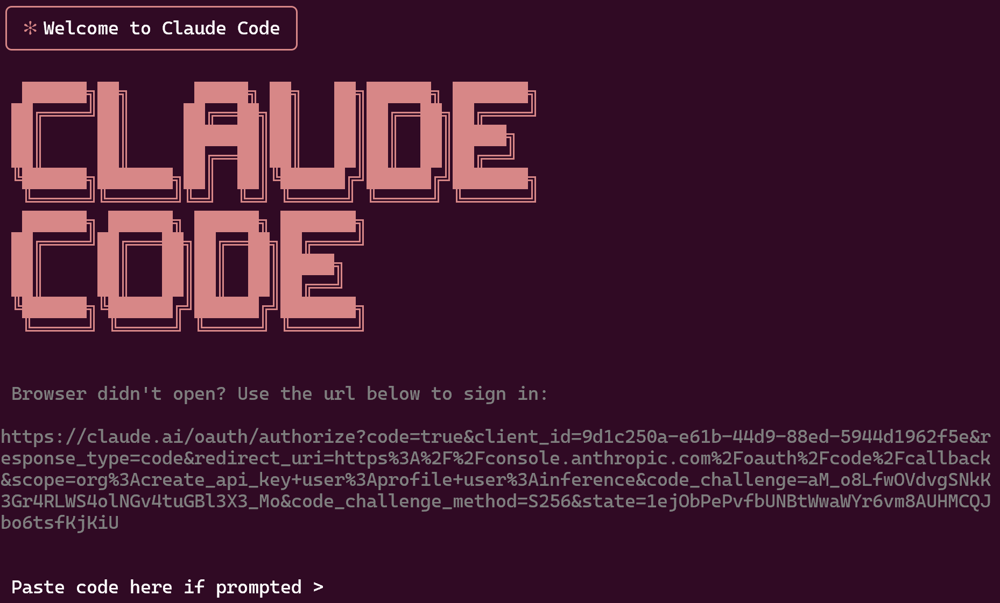
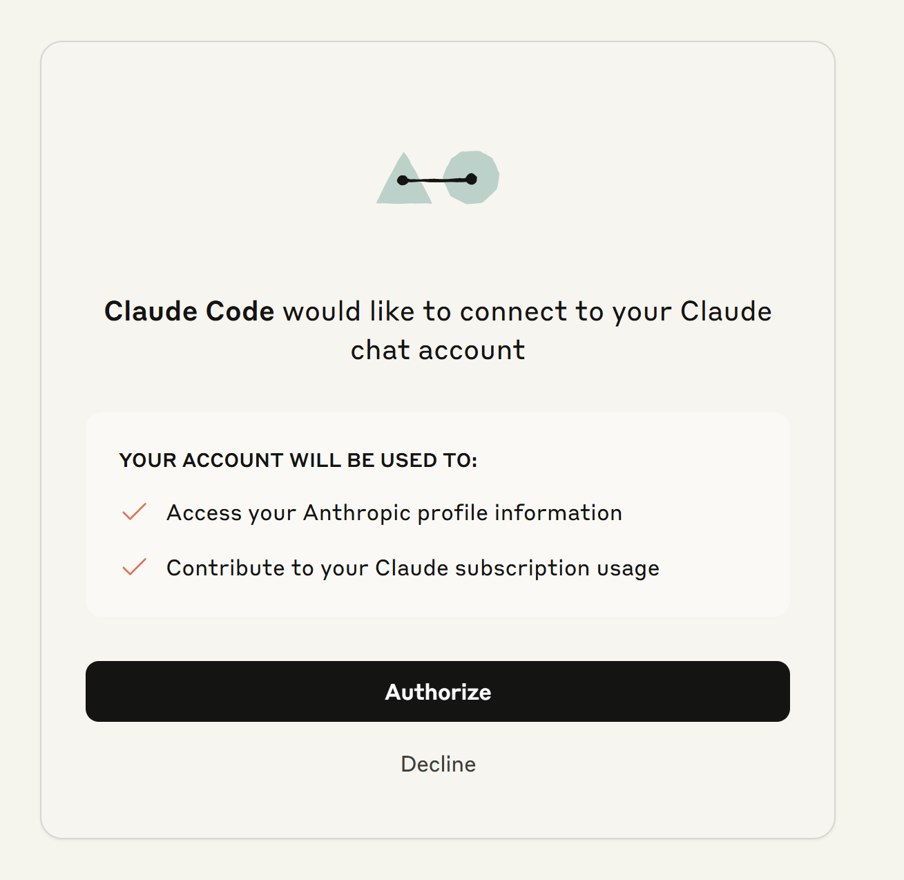
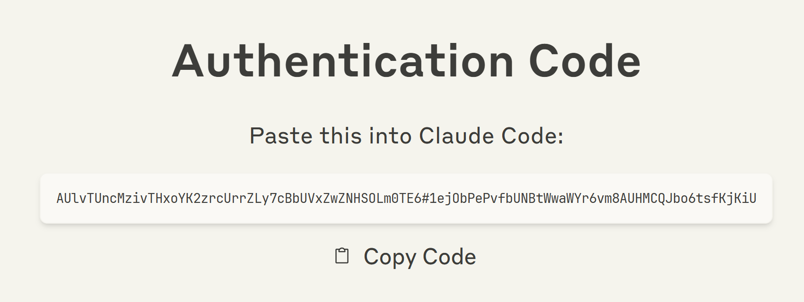
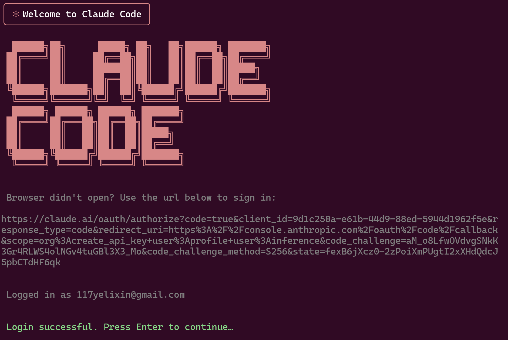

# 从 CLI 到 Web：Claude Code OAuth 认证的演进之路

## 1. 引言：一个关于"拼车"的故事

项目源于一个朴素的想法：想和小伙伴"拼车"使用 Claude Code。
200刀的max订阅着实不便宜，我一个人也没有这么大的用量，拼车即能合理的分摊成本，又能和好友共享这个目前（我认为）最强大的 AI 编程工具。

但是，要实现需求，首要解决的一个核心问题：**Claude Code 是如何与 Anthropic 的 API 进行安全认证的？**

具体来说，我们需要弄清楚两个关键问题：
- Claude Code 客户端如何对用户账号进行认证？
- 认证成功后，如何向 API 发起请求？

只有深入理解了 Claude Code 的认证机制，我们才能构建一个安全可靠的 API 网关，在保护用户隐私的前提下实现"拼车"共享。

这篇文章将带你从 Claude Code CLI 的原生认证流程开始，一步步了解 OAuth 2.0 + PKCE 的实现细节，并展示如何将这套机制迁移到 Web 环境中。

## 2. OAuth 2.0 流程预备知识

### 2.1 三个关键角色

在深入了解 Claude Code 的认证流程前，我们需要先明确 OAuth 2.0 中的三个关键角色：

| 角色 | 在 Claude Code 场景中 | 职责 |
|------|---------------------|------|
| **资源所有者**<br>(Resource Owner) | 你（用户） | • 拥有 Anthropic 账号<br>• 决定是否授权 |
| **客户端**<br>(Client) | Claude Code CLI | • 请求访问权限<br>• 使用获得的令牌调用 API |
| **授权服务器**<br>(Authorization Server) | Anthropic OAuth 服务 | • 验证用户身份<br>• 颁发访问令牌<br>• 管理权限范围 |

理解这三方的角色关系是理解整个 OAuth 流程的关键。接下来的每个步骤，都是这三方之间的交互。

### 2.2 两大安全机制

#### 2.2.1 PKCE 安全机制

PKCE（Proof Key for Code Exchange）是 OAuth 2.0 的安全增强机制，专门防止授权码被截获后的恶意利用。

**为什么授权码被截获很危险？**

在传统的 OAuth 流程中，如果攻击者通过网络监听、恶意软件或其他手段截获了授权码，他们可以：
- 使用截获的授权码向授权服务器请求访问令牌
- 获得完整的账号访问权限
- 消耗用户的资源配额
- 窃取敏感数据

这就像有人偷看了你的快递取件码，然后冒充你去取走了包裹。

**工作原理**：

1. **生成密钥对**（[步骤一](#311-步骤一启动认证流程)）：客户端生成一个随机字符串 `code_verifier`，然后计算其 SHA256 哈希值作为 `code_challenge`
   ```
   code_verifier = "dBjftJeZ4CVP-mB92K27uhbUJU1p1r_wW1gFWFOEjXk"  // 原始随机字符串，保存在本地
   code_challenge = SHA256(code_verifier) = "aM_o8LfwOVdvgSNkK3Gr4RLWS4olNGv4tuGBl3X3_Mo"  // 发送给服务器
   ```

2. **发送 code_challenge**（[步骤一](#311-步骤一启动认证流程)）：在授权请求中只发送 `code_challenge`，不发送 `code_verifier`

3. **验证身份**（[步骤四](#322-步骤四token-安全交换---pkce-的关键作用)）：Token 交换时提供 `code_verifier`，服务器验证：
   ```
   SHA256(code_verifier) === code_challenge
   ```

**为什么 PKCE 能够防护？**

PKCE 的巧妙之处在于：
- 攻击者即使截获了授权码，也没有原始的 `code_verifier`
- SHA256 是单向哈希函数，无法从 `code_challenge` 反推出 `code_verifier`
- 没有 `code_verifier`，就无法通过服务器的验证，Token 交换会失败

这就像一把特殊的锁 —— 即使小偷拿到了你家地址（授权码），没有钥匙（verifier）也进不了门。而这把钥匙从始至终都安全地保存在你的本地，从未在网络上传输过。

#### 2.2.2 State 参数与 CSRF 防护

`state` 参数是 OAuth 2.0 中防止跨站请求伪造（CSRF）攻击的重要机制。

**CSRF 攻击原理**：
攻击者可能构造一个恶意的授权请求，诱导你点击，让你在不知情的情况下授权攻击者的应用访问你的账号。

**State 参数如何防护**：
1. 客户端生成一个随机的 `state` 值（[步骤一](#311-步骤一启动认证流程)）
2. 在授权请求中发送这个 `state` 值
3. 授权服务器在回调时原样返回 `state` 值（[步骤三](#321-步骤三回调页面与授权码获取)）
4. 客户端验证返回的 `state` 是否与发送的一致

如果 `state` 不匹配，说明这个回调可能来自攻击者，客户端会拒绝处理。这就像取快递时的取件码——只有你自己知道的取件码对上了，才能确认这个包裹确实是给你的。

## 3. Claude Code CLI 认证流程详解

### 3.1 授权请求阶段

#### 3.1.1 步骤一：启动认证流程
```bash
$ claude
```

当在 Claude Code CLI 中选择账号登录后，Claude Code 会生成一个 OAuth 授权链接并尝试在浏览器中打开。如果浏览器无法自动打开，CLI 会显示完整的授权 URL 供用户手动访问。



**OAuth URL 参数解析：**

| 类别 | 参数 | 值 | 说明 |
|------|------|-----|------|
| **身份标识** | `client_id` | `9d1c250a-e61b-44d9-88ed-5944d1962f5e` | Claude Code 的 OAuth 客户端 ID（所有 Claude Code 实例共用） |
| **授权模式** | `code` | `true` | 启用授权码模式标识 |
| **授权模式** | `response_type` | `code` | 指定 OAuth 流程类型为授权码模式 |
| **权限范围** | `scope` | `org:create_api_key`<br>`user:profile`<br>`user:inference` | 请求的权限范围：<br>• 创建组织 API 密钥<br>• 访问用户信息<br>• 执行推理请求 |
| **流程控制** | `redirect_uri` | `https://console.anthropic.com/oauth/code/callback` | 授权成功后的回调地址 |
| **安全机制** | `state` | `1ejObPePvfbUNBtWwaWYr6vm8AUHMCQJbo6tsfKjKiU` | 防止 CSRF 攻击（[详见预备知识](#222-state-参数与-csrf-防护)） |
| **安全机制** | `code_challenge` | `aM_o8LfwOVdvgSNkK3Gr4RLWS4olNGv4tuGBl3X3_Mo` | PKCE 挑战码（[详见预备知识](#221-pkce-安全机制)） |
| **安全机制** | `code_challenge_method` | `S256` | PKCE 加密方法（SHA256） |

简单来说，这个 OAuth URL 就像你去酒店办理 check-in 时的申请单：
- `client_id` 告诉 Anthropic "这是通过 Claude Code 来的用户"
- `scope` 说明你需要哪些权限
- 其他参数确保整个过程的安全性

整个过程中，你（用户）授权 Claude Code（客户端）访问 Anthropic（授权服务器）的服务。重要的是，你的密码始终只在 Anthropic 处验证，Claude Code 永远看不到。

#### 3.1.2 步骤二：浏览器授权页面

在浏览器中打开授权链接后，会跳转到 Anthropic 的 OAuth 授权页面：



这一步就是让你来做决定：是否同意 Claude Code 访问你的 Anthropic 账号？只有你点击了"Authorize"按钮，Claude Code 才能获得相应的权限。这是整个流程中最关键的一步——把选择权交给你。

### 3.2 授权响应阶段

#### 3.2.1 步骤三：回调页面与授权码获取

当用户在授权页面点击 "Authorize" 按钮后，浏览器会重定向到回调页面：



**关键流程解析：**

1. **浏览器重定向**：用户确认授权后，Anthropic 将浏览器重定向到[步骤一](#311-步骤一启动认证流程)中指定的 `redirect_uri`：
   ```
   https://console.anthropic.com/oauth/code/callback?code=ac_2PJ...&state=1ejO...
   ```
   
   注意这个地址正是步骤一 OAuth URL 中的 `redirect_uri` 参数值。

2. **授权码颁发**：URL 参数中的 `code` 就是 Anthropic 颁发的授权码（Authorization Code）
   - 授权码是一次性的，有效期很短（通常 10 分钟）
   - 必须配合正确的 PKCE verifier 才能使用
   - 这是 OAuth 2.0 的核心安全设计：授权码本身不是访问令牌

3. **状态验证**：`state` 参数原样返回，Claude Code 会验证其是否与步骤一发送的一致（[详见预备知识](#222-state-参数与-csrf-防护)）

这一步就像 Anthropic 给了你一张"取货凭证"（授权码）。这张凭证有效期很短，必须赶紧拿去换取真正的"通行证"（访问令牌）。

#### 3.2.2 步骤四：Token 安全交换 - PKCE 的关键作用

回到 CLI 界面，将授权码粘贴到命令行中：



```bash
Please enter the authorization code from your browser: 
> ac_2PJ3kL5mN7qR9sT...
```

CLI 收到授权码后，立即发起 Token 交换请求：

```
POST https://api.anthropic.com/oauth/token
{
  "grant_type": "authorization_code",
  "code": "ac_2PJ3kL5mN7qR9sT...",
  "client_id": "9d1c250a-e61b-44d9-88ed-5944d1962f5e",
  "code_verifier": "dBjftJeZ4CVP-mB92K27uhbUJU1p1r_wW1gFWFOEjXk",
  "redirect_uri": "https://console.anthropic.com/oauth/code/callback"
}
```

**PKCE 验证**：

此时 Anthropic 服务器会执行 PKCE 验证（[详见预备知识](#221-pkce-安全机制)）：

```
收到的 code_verifier = "dBjftJeZ4CVP-mB92K27uhbUJU1p1r_wW1gFWFOEjXk"
步骤一的 code_challenge = "aM_o8LfwOVdvgSNkK3Gr4RLWS4olNGv4tuGBl3X3_Mo"
验证：SHA256(code_verifier) === code_challenge ✓
```

只有验证通过，Token 交换才会成功。这确保了即使授权码被截获，攻击者也无法完成认证流程。

### 3.3 Token 管理阶段

#### 3.3.1 步骤五：获取访问令牌并本地存储

Token 交换验证通过后，Anthropic 返回访问令牌，Claude Code 将其存储到本地配置文件 `.credentials.json`：
```json
{
  "claudeAiOauth": {
    "accessToken": "sk-ant-oat01-...",
    "refreshToken": "sk-ant-ort01-...",
    "expiresAt": 1754945252465,
    "scopes": ["user:inference", "user:profile"],
    "subscriptionType": "max"
  }
}
```

| 字段 | 说明 |
|------|------|
| `accessToken` | API 调用令牌（短期，8 小时） |
| `refreshToken` | 刷新令牌（长期） |
| `expiresAt` | accessToken 的过期时间戳（毫秒） |
| `scopes` | 权限范围 |
| `subscriptionType` | 订阅类型（`max` / `pro`） |

至此，OAuth 认证流程完成！Claude Code 已经安全地获得了访问你 Anthropic 账号资源的"钥匙"，可以开始愉快地使用了。

#### 3.3.2 步骤六：Token 自动刷新机制

`accessToken` 的有效期为 8 小时，当 Claude Code 检测到令牌即将过期时，会自动使用 `refreshToken` 获取新的访问令牌。

**刷新请求**：
```
POST https://api.anthropic.com/oauth/token
{
  "grant_type": "refresh_token",
  "refresh_token": "sk-ant-ort01-...",
  "client_id": "9d1c250a-e61b-44d9-88ed-5944d1962f5e"
}
```

> **⚠️ 安全警告**
> 
> `refreshToken` 就像你家的备用钥匙 —— 丢了它，别人就能一直进你家。
> 
> 即使你改了密码，拿到 `refreshToken` 的人依然能持续访问你的 Claude 账号，消耗额度，窃取对话记录。
> 
> **请务必**：
> - 不要分享 `.credentials.json` 文件
> - 不要提交令牌到 Git 仓库  
> - 定期检查账号活动，发现异常立即撤销授权