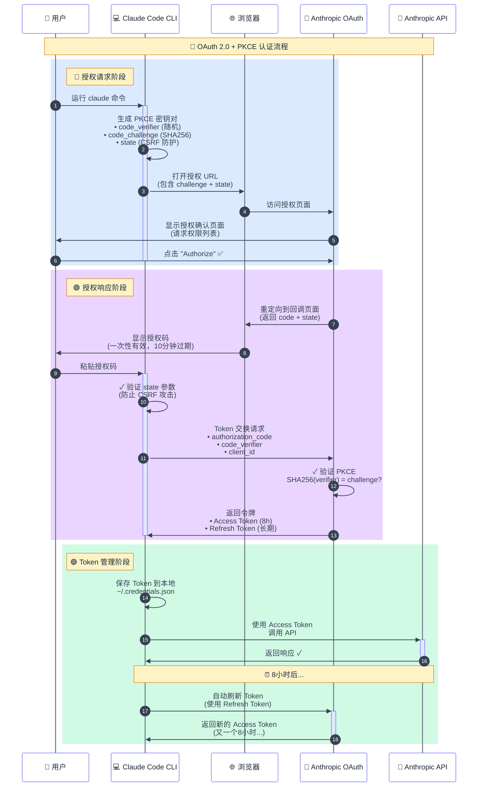

# 200刀太贵，我决定研究 Claude Code（一）：认证篇

## 1. 引言：一个关于"拼车"的想法

项目源于一个朴素的想法：与小伙伴"拼车"使用 Claude Code。

200刀的max订阅不便宜，拼车能合理的分摊成本，又能和好友一起使用、讨论这个目前（我认为）最强大的 AI 编程工具，岂不快哉。

想要实现需求，最核心的两个问题：
- **Claude Code 客户端如何对用户账号进行认证？**
- **认证成功后，如何向 API 发起请求？**

这篇文章将详细解析 Claude Code CLI 的原生认证流程，带你一步步了解 OAuth 2.0 + PKCE 的实现细节。

> 实际上这与接入L站登录没什么区别。
> 
> 建议A社立刻开放L站用户登录，免费使用Opus!!!

## 2. OAuth 2.0 流程预备知识

### 2.1 三个关键角色

在进入 Claude Code 的认证流程前，我们需要先明确 OAuth 2.0 中的三个关键角色：

| 角色 | 在 Claude Code 场景中 | 职责 |
|------|---------------------|------|
| **资源所有者**<br>(Resource Owner) | 你（用户） | • 拥有 Anthropic 账号<br>• 决定是否授权 |
| **客户端**<br>(Client) | Claude Code CLI | • 请求访问权限<br>• 使用获得的令牌调用 API |
| **授权服务器**<br>(Authorization Server) | Anthropic OAuth 服务 | • 验证用户身份<br>• 颁发访问令牌<br>• 管理权限范围 |

理解这三方的角色关系是理解整个 OAuth 流程的关键。接下来的每个步骤，都是这三方之间的交互。

### 2.2 两大安全机制

#### 2.2.1 State 参数与 CSRF 防护

> 💡 **State 参数**：防止恶意网站偷偷让你授权给攻击者。

`state` 参数是 OAuth 2.0 中防止跨站请求伪造（CSRF）攻击的重要机制。

**CSRF 攻击原理**：
攻击者可能构造一个恶意的授权请求，诱导你点击，让你在不知情的情况下授权攻击者的应用访问你的账号。

**State 参数如何防护**：
1. 客户端生成一个随机的 `state` 值（[步骤一](#311-步骤一启动认证流程)）
2. 在授权请求中发送这个 `state` 值
3. 授权服务器在回调时原样返回 `state` 值（[步骤三](#321-步骤三回调页面与授权码获取)）
4. 客户端验证返回的 `state` 是否与发送的一致

如果 `state` 不匹配，说明这个回调可能来自攻击者，客户端会拒绝处理。

这就像取快递时的取件码——驿站小哥需要确定你的取件码，他们才会把快递给你。

#### 2.2.2 PKCE 安全机制

> 💡 **PKCE**：即使授权码被偷了，攻击者也无法使用。

PKCE（Proof Key for Code Exchange）是 OAuth 2.0 的安全增强机制，专门防止授权码被截获后的恶意利用。

**为什么授权码被截获很危险？**

在传统的 OAuth 流程中，如果攻击者通过网络监听、恶意软件或其他手段截获了授权码，他们可以：
- 使用截获的授权码向授权服务器请求访问令牌
- 获得完整的账号访问权限
- 消耗用户的资源配额
- 窃取敏感数据

这就像有人偷看了你的快递取件码，然后冒充你取走了包裹。

**PKCE的工作原理复杂一些**：

1. **生成密钥对**（[步骤一](#311-步骤一启动认证流程)）：客户端生成一个随机字符串 `code_verifier`，然后计算其 SHA256 哈希值作为 `code_challenge`
   ```
   code_verifier = "dBjftJeZ4CVP-mB92K27uhbUJU1p1r_wW1gFWFOEjXk"  // 原始随机字符串，保存在本地
   code_challenge = SHA256(code_verifier) = "aM_o8LfwOVdvgSNkK3Gr4RLWS4olNGv4tuGBl3X3_Mo"  // 发送给服务器
   ```

2. **发送 code_challenge**（[步骤一](#311-步骤一启动认证流程)）：在授权请求中只发送 `code_challenge`，不发送 `code_verifier`

3. **验证身份**（[步骤四](#322-步骤四token-安全交换---pkce-的关键作用)）：Token 交换时提供 `code_verifier`，服务器验证：
   ```
   SHA256(code_verifier) === code_challenge
   ```

**为什么 PKCE 能够防护？**

PKCE 的巧妙之处在于：
- 攻击者即使截获了授权码，也没有原始的 `code_verifier`
- SHA256 是单向哈希函数，无法从 `code_challenge` 反推出 `code_verifier`
- 没有 `code_verifier`，就无法通过服务器的验证，Token 交换会失败

这就像银行的双重验证 —— 即使小偷拿到了你的银行卡（授权码），没有密码（verifier）也取不了钱。
虽然你最终要在 ATM 机上输入密码，但密码是通过安全的加密通道（HTTPS）直接传给银行的，而不是通过容易被窥视的浏览器重定向。

## 3. Claude Code CLI 认证流程详解

在深入每个步骤的细节之前，让我们先通过一张流程图了解整个 OAuth 认证的全貌：



这个流程展示了 Claude Code 如何通过 OAuth 2.0 + PKCE 安全地获取访问权限：

1. **授权请求阶段**（蓝色）：CLI 生成安全参数，引导用户在浏览器中完成授权
2. **授权响应阶段**（紫色）：用户授权后，CLI 使用授权码和 PKCE verifier 交换访问令牌
3. **Token 管理阶段**（绿色）：CLI 保存令牌并管理其生命周期，包括自动刷新

接下来，让我们详细了解每个步骤的具体实现。

### 3.1 授权请求阶段

#### 3.1.1 步骤一：启动认证流程
```bash
$ claude
```

当在 Claude Code CLI 中选择账号登录后，Claude Code 会生成一个 OAuth 授权链接并尝试在浏览器中打开。如果浏览器无法自动打开，CLI 会显示完整的授权 URL 供用户手动访问。


**OAuth URL 参数解析：**

| 类别 | 参数 | 说明 |
|------|------|------|
| **身份** | `client_id` | Claude Code 的 OAuth 客户端 ID（所有 Claude Code 实例共用） |
| **模式** | `code` | 启用授权码模式标识 |
| **模式** | `response_type` | 指定 OAuth 流程类型为授权码模式 |
| **权限** | `scope` | 请求的权限范围：创建组织 API 密钥、访问用户信息、执行推理请求 |
| **回调** | `redirect_uri` | 授权成功后的回调地址 |
| **安全** | `state` | 防止 CSRF 攻击（[详见预备知识](#221-state-参数与-csrf-防护)） |
| **安全** | `code_challenge` | PKCE 挑战码（[详见预备知识](#222-pkce-安全机制)） |
| **安全** | `code_challenge_method` | PKCE 加密方法（SHA256） |

这些参数共同构成了一个完整的授权请求。

这正是 OAuth 的核心价值：Claude Code 不需要存储你的密码，只需要通过授权，就能安全地访问你的账号资源。

#### 3.1.2 步骤二：浏览器授权页面

在浏览器中打开授权链接后，会跳转到 Anthropic 的 OAuth 授权页面：


在这个页面上，Anthropic 会明确展示 Claude Code 请求的权限范围（即上一步中的 scope 参数）。只有在你确认并点击"Authorize"后，Anthropic 才会颁发授权码。这确保了用户对授权过程的完全知情和控制。

### 3.2 授权响应阶段

#### 3.2.1 步骤三：回调页面与授权码获取

当用户在授权页面点击 "Authorize" 按钮后，浏览器会重定向到回调页面：


**关键流程解析：**

1. **浏览器重定向**：用户确认授权后，Anthropic 将浏览器重定向到回调地址：
   ```
   https://console.anthropic.com/oauth/code/callback?code=ac_2PJ...&state=1ejO...
   ```

2. **授权码颁发**：URL 参数中的 `code` 就是 Anthropic 颁发的授权码（Authorization Code）
   - 授权码是一次性的，有效期很短（通常 10 分钟）
   - 必须配合正确的 PKCE verifier 才能使用
   - 这是 OAuth 2.0 的核心安全设计：授权码本身不是访问令牌

3. **状态验证**：`state` 参数原样返回，Claude Code 会验证其是否与步骤一发送的一致（[详见预备知识](#221-state-参数与-csrf-防护)）

这一步中 Anthropic 给了你一张"取货凭证"（授权码）。这张凭证有效期很短，必须赶紧拿去换取真正的"通行证"（访问令牌）。

#### 3.2.2 步骤四：Token 安全交换 - PKCE 的关键作用

回到 CLI 界面，将授权码粘贴到命令行中，叮...登录成功!!!：


这一步中，实际上 CLI 收到授权码后，立即发起 Token 交换请求：

```
POST https://api.anthropic.com/oauth/token
{
  "grant_type": "authorization_code",
  "code": "ac_2PJ3kL5mN7qR9sT...",
  "client_id": "9d1c250a-e61b-44d9-88ed-5944d1962f5e",
  "code_verifier": "dBjftJeZ4CVP-mB92K27uhbUJU1p1r_wW1gFWFOEjXk",
  "redirect_uri": "https://console.anthropic.com/oauth/code/callback"
}
```

**PKCE 验证**：

此时 Anthropic 服务器会执行 PKCE 验证（[详见预备知识](#222-pkce-安全机制)）：

```
收到的 code_verifier = "dBjftJeZ4CVP-mB92K27uhbUJU1p1r_wW1gFWFOEjXk"
步骤一的 code_challenge = "aM_o8LfwOVdvgSNkK3Gr4RLWS4olNGv4tuGBl3X3_Mo"
验证：SHA256(code_verifier) === code_challenge ✓
```

只有验证通过，Token 交换才会成功。这确保了即使授权码被截获，攻击者也无法完成认证流程。

### 3.3 Token 管理阶段

#### 3.3.1 步骤五：获取访问令牌并本地存储

Token 交换验证通过后，Anthropic 返回访问令牌，Claude Code 将其存储到本地配置文件 `.credentials.json`：
```json
{
  "claudeAiOauth": {
    "accessToken": "sk-ant-oat01-...",
    "refreshToken": "sk-ant-ort01-...",
    "expiresAt": 1754945252465,
    "scopes": ["user:inference", "user:profile"],
    "subscriptionType": "max"
  }
}
```

| 字段 | 说明 |
|------|------|
| `accessToken` | API 调用令牌（短期，8 小时） |
| `refreshToken` | 刷新令牌（长期） |
| `expiresAt` | accessToken 的过期时间戳（毫秒） |
| `scopes` | 权限范围 |
| `subscriptionType` | 订阅类型（`max` / `pro`） |

至此，OAuth 认证流程完成！Claude Code 已经安全地获得了访问你 Anthropic 账号资源的"钥匙"，可以开始愉快地使用了。

#### 3.3.2 步骤六：Token 自动刷新机制

`accessToken` 的有效期为 8 小时，当 Claude Code 检测到令牌即将过期时，会自动使用 `refreshToken` 获取新的访问令牌。

**刷新请求**：
```
POST https://api.anthropic.com/oauth/token
{
  "grant_type": "refresh_token",
  "refresh_token": "sk-ant-ort01-...",
  "client_id": "9d1c250a-e61b-44d9-88ed-5944d1962f5e"
}
```

> **⚠️ 安全警告**
> 
> `refreshToken` 就像你家的备用钥匙 —— 丢了它，别人就能一直进你家。
> 
> 即使你改了密码，拿到 `refreshToken` 的人依然能持续访问你的 Claude 账号，消耗额度，窃取对话记录。
> 
> **请务必**：
> - 不要分享 `.credentials.json` 文件
> - 不要提交令牌到 Git 仓库  
> - 定期检查账号活动，发现异常立即撤销授权

## 4. 总结

看到这里，你已经完全掌握了 Claude Code CLI 的认证流程。

**Claude Code 用了三招保证安全**：
- PKCE：即使授权码被偷了也没用，因为小偷没有本地的密钥
- State：防止恶意网站偷偷让你授权
- 短期授权码：10分钟就过期，用完就扔

**最重要的是**：保护好你的 `.credentials.json` 文件！这就是你家的钥匙，丢了就麻烦了。

理解了这套机制，不管是自己开发 CLI 工具，还是构建 API 网关来"拼车"，你都有了坚实的基础。

下篇文章我们聊聊怎么在 Web 环境里实现同样的认证流程，敬请期待！