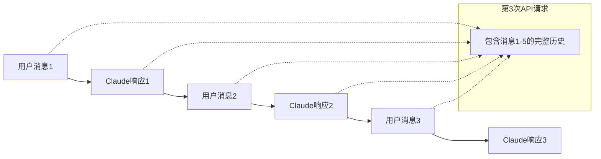
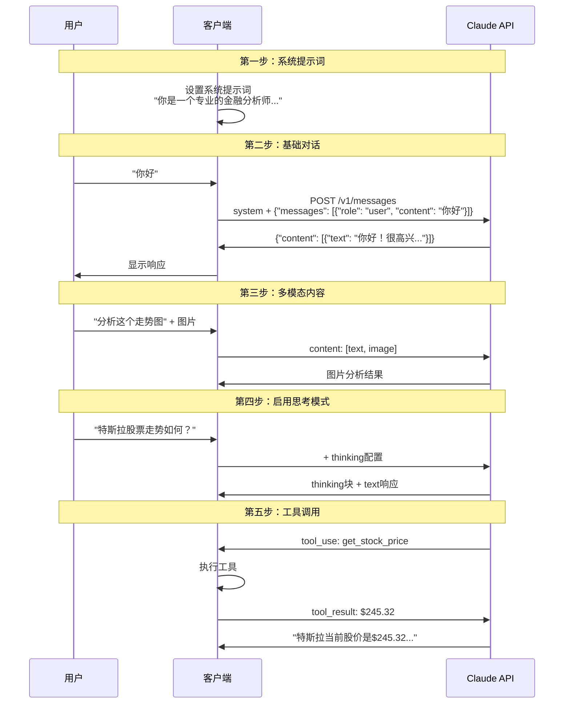
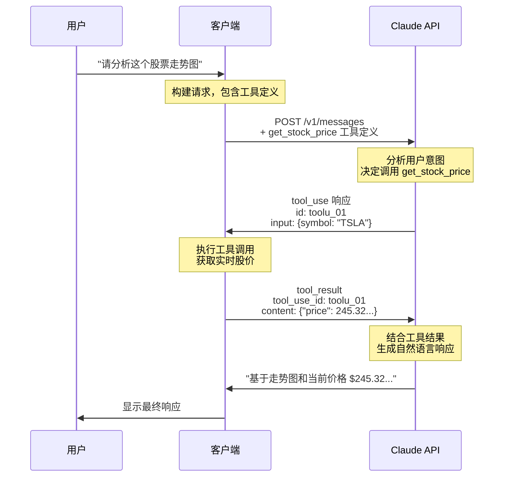

# 200刀太贵，我决定研究 Claude Code（三）API 篇：Claude API 深度解析

## 1. 引言

在尝试为 Claude Code 引入入外部 LLM 供应商时，我们遇到的核心挑战：如何在 Claude API 和 OpenAI API 格式之间进行准确的转换。

这实际并不是一个简单的问题。Claude API 有其独特的设计 —— thinking 模式、tool use 机制、多模态支持等，每个特性都需要深入理解才能正确转换。

本文将通过完整的示例和详细的解析，帮助我们更全面的理解 Claude API 的请求与响应结构。

## 2. Claude API 请求剖析

### 2.1 请求与响应的本质

LLM API 的标准设计：**每次请求都包含完整的对话历史，而响应则是基于这个完整上下文生成的新内容**。



这种无状态设计带来了显著的优势：
- **可靠性**：每个请求都是自包含的，不依赖服务端状态
- **灵活性**：客户端可以随时修改、重组历史消息
- **可调试性**：任何请求都可以独立重现和调试

### 2.2 核心角色系统

Claude API 定义了严格的角色系统：

| 角色 | 说明 | 位置 | 约束 |
|------|------|------|------|
| `system` | 系统提示词 | 请求顶层 | 单一、可选，定义整体行为 |
| `user` | 用户消息 | messages 数组 | 可包含文本、图片、工具结果 |
| `assistant` | 助手响应 | messages 数组 | 可包含文本、工具调用 |

**重要约束**：在 `messages` 数组中，消息必须严格遵循 user-assistant 交替模式：
- 不能连续出现两条相同角色的消息
- 工具结果（tool_result）虽然是工具执行后返回的，但使用 `user` 角色来传递给 Claude

### 2.3 内容类型体系

每个消息的 `content` 字段支持两种形式：

```json
// 形式1：简单字符串（仅支持纯文本）
"content": "Hello, Claude!"

// 形式2：结构化数组（支持多种内容类型）
"content": [
    {"type": "text", "text": "分析这张图"},
    {"type": "image", "source": {...}}
]
```

完整的内容类型表：

| 类型 | 可用角色 | 描述 | 详细文档 |
|------|----------|------|----------|
| `text` | user, assistant | 纯文本内容 | [本章](#23-内容类型体系) |
| `image` | user | 图片输入 | [本章](#第三步多模态输入) |
| `thinking` | assistant | 推理过程内容（需启用思考模式） | [第4.2章](#思考模式响应) |
| `tool_use` | assistant | 工具调用请求 | [第3章](#3-工具调用机制详解) |
| `tool_result` | user | 工具执行结果 | [第3章](#3-工具调用机制详解) |

### 2.4 渐进式请求讲解

让我们通过一个完整的对话流程，深入理解每个请求特性。本节将逐步构建一个包含所有核心特性的请求，完整示例请参见 [附录：完整请求示例](#附录完整请求示例)。



#### 第一步：设置系统提示词

系统提示词定义了 Claude 的角色和行为准则，在整个对话中持续生效：

```json
{
    "system": "你是一个专业的金融分析师，擅长股票市场分析。请用专业但易懂的语言回答问题。"
}
```

**系统提示词的特点**：
- 在整个对话中持续生效
- 与 OpenAI 不同，系统提示词不在 messages 数组中，而是作为请求的顶层参数
- 影响 Claude 的回答风格和专业性

#### 第二步：基础对话结构

包含系统提示词的基础请求：

```json
{
    "model": "claude-opus-4-1-20250805",
    "max_tokens": 1024,
    "system": "你是一个专业的金融分析师，擅长股票市场分析。请用专业但易懂的语言回答问题。",
    "messages": [
        {"role": "user", "content": "特斯拉的股票值得投资吗？"}
    ]
}
```

**关键要素**：
- `model`：指定使用的模型版本
- `max_tokens`：限制响应的最大 token 数
- `system`：系统提示词，定义角色和行为
- `messages`：包含对话历史的数组

#### 第三步：多模态内容

当需要发送图片时，content 结构发生变化：

```json
{
    "messages": [
        {
            "role": "user",
            "content": [
                {
                    "type": "text",
                    "text": "请分析这个股票走势图"
                },
                {
                    "type": "image",
                    "source": {
                        "type": "base64",
                        "media_type": "image/png",
                        "data": "iVBORw0KGgoAAAANSUhEUgA..."
                    }
                }
            ]
        }
    ]
}
```

**图片支持的要点**：
- 支持的格式：JPEG、PNG、GIF、WebP（最大 5MB）
- 三种提供图片的方式：
  - Base64 编码：在 image 内容块中使用 base64 编码的图片
  - URL 引用：引用在线托管的图片 URL
  - Files API：上传一次，多次使用

#### 第四步：启用思考模式

思考模式让 Claude 的推理过程变得透明。在请求中添加 `thinking` 配置：

```json
{
    "model": "claude-opus-4-1-20250805",
    "max_tokens": 1024,
    "thinking": {
        "type": "enabled",
        "budget_tokens": 10000
    },
    "messages": [...]
}
```

启用后，Claude 的响应会包含独立的思考内容块：

```json
{
    "role": "assistant",
    "content": [
        {
            "type": "thinking",
            "thinking": "用户提供了一个股票走势图，需要我进行分析。\n从图表看，这是特斯拉(TSLA)的走势图。\n为了进行准确的分析，我需要获取当前的实时价格，以便将图表趋势与最新价格结合起来分析。"
        },
        {
            "type": "text",
            "text": "从走势图来看，我需要获取当前的实时价格来进行更准确的分析。"
        }
    ]
}
```

**关键点**：
- `thinking` 内容独立于用户可见的 `text` 内容
- 展示 Claude 的内部推理过程，便于调试和理解
- 详细解析见 [第4.2章：思考模式响应](#思考模式响应)

#### 第五步：工具调用

当 Claude 需要外部数据或功能时，会在响应中包含工具调用请求：

```json
{
    "role": "assistant",
    "content": [
        {
            "type": "thinking",
            "thinking": "用户提供了一个股票走势图，需要我进行分析。\n从图表看，这是特斯拉(TSLA)的走势图。\n为了进行准确的分析，我需要获取当前的实时价格，以便将图表趋势与最新价格结合起来分析。"
        },
        {
            "type": "text",
            "text": "从走势图来看，我需要获取当前的实时价格来进行更准确的分析。"
        },
        {
            "type": "tool_use",
            "id": "toolu_01",
            "name": "get_stock_price",
            "input": {"symbol": "TSLA"}
        }
    ]
}
```

**工具调用要点**：
- 需要在请求中预先定义 `tools` 数组
- Claude 自动决定何时调用工具
- `stop_reason` 会变为 `tool_use`，等待客户端执行
- 完整流程详见 [第3章：工具调用机制](#3-工具调用机制详解)

### 2.5 请求参数详解

除了核心的消息结构，Claude API 还支持多个控制参数：

| 参数 | 类型 | 说明 |
|------|------|------|
| `temperature` | number | 控制随机性（0-1），默认1 |
| `top_p` | number | 核采样参数（0-1） |
| `top_k` | integer | 限制候选 token 数量 |
| `stream` | boolean | 是否启用流式响应，详见 [第5章](#5-流式响应实时交互的实现) |
| `stop_sequences` | array | 停止生成的标记序列 |

### 2.6 小结

通过本章的详细剖析，我们深入理解了 Claude API 请求的核心要素：

- **完整历史累积**：每次请求包含完整对话历史
- **严格角色系统**：user-assistant 消息必须交替出现
- **灵活内容类型**：支持文本、图片、工具调用等多种形式
- **渐进式特性**：从简单文本到复杂的多模态和工具调用

这些设计为构建强大的 AI 应用提供了基础，也为我们后续的格式转换工作指明了方向。接下来的章节将深入探讨[工具调用](#3-工具调用机制详解)、[响应格式](#4-响应内容深度剖析)等高级特性。

## 3. 工具调用机制详解

### 3.1 为什么工具调用如此重要

工具调用是 LLM 迈向 Agent 的分水岭。没有工具调用时，LLM 只能基于训练数据回答；有了工具调用后，它能获取实时信息、执行操作、与外部世界交互。

过去用 ChatGPT，我们在 AI 和代码间来回复制粘贴。今天的 Claude Code 直接读写文件、运行测试 —— 从"对话式助手"到"自主编程 Agent"，AI 终于能真正操作你的开发环境。

### 3.2 工具调用的完整流程

让我们通过一个完整的流程图和实例，理解工具调用的生命周期：



#### 步骤 1：工具定义

客户端在请求中声明可用工具。每个工具都需要清晰的描述和参数定义，帮助 Claude 理解何时以及如何使用：

```json
{
    "model": "claude-opus-4-1-20250805",
    "max_tokens": 1024,
    "tools": [{
        "name": "get_stock_price",
        "description": "获取股票的实时价格",
        "input_schema": {
            "type": "object",
            "properties": {
                "symbol": {
                    "type": "string",
                    "description": "股票代码，如 AAPL"
                }
            },
            "required": ["symbol"]
        }
    }],
    "messages": [...]
}
```

关键点：
- **`description` 要清晰**，让 Claude 知道这个工具的用途
- `input_schema` 使用 JSON Schema 格式，定义参数类型和约束
- **工具定义在整个对话期间有效**，无需重复声明

#### 步骤 2：Claude 的思考过程

启用思考模式后，Claude 首先分析用户意图：

```json
{
    "type": "thinking",
    "thinking": "用户提供了一个股票走势图，需要我进行分析。\n从图表看，这是特斯拉(TSLA)的走势图。\n为了进行准确的分析，我需要获取当前的实时价格，以便将图表趋势与最新价格结合起来分析。"
}
```

#### 步骤 3：工具调用决策

基于思考结果，Claude 决定调用工具并生成响应：

```json
{
    "role": "assistant",
    "content": [
        {
            "type": "thinking",
            "thinking": "用户提供了一个股票走势图，需要我进行分析。\n从图表看，这是特斯拉(TSLA)的走势图。\n为了进行准确的分析，我需要获取当前的实时价格，以便将图表趋势与最新价格结合起来分析。"
        },
        {
            "type": "text",
            "text": "从走势图来看，我需要获取当前的实时价格来进行更准确的分析。"
        },
        {
            "type": "tool_use",
            "id": "toolu_01",
            "name": "get_stock_price",
            "input": {"symbol": "TSLA"}
        }
    ],
    "stop_reason": "tool_use"
}
```

关键点：
- **思考过程透明化**：thinking 块展示了 Claude 的推理过程
- **`stop_reason: "tool_use"`** 表示响应暂停等待工具执行
- 完整响应示例参见[附录](#附录完整请求示例)

#### 步骤 4：客户端执行并返回结果

客户端看到 `tool_use` 响应后，需要：
1. 解析工具名称和参数
2. 执行实际的 API 调用或操作
3. 将结果包装成新的用户消息发送回 Claude

```json
{
    "model": "claude-opus-4-1-20250805",
    "max_tokens": 1024,
    "tools": [/* 原工具定义 */],
    "messages": [
        /* 之前的对话历史 */,
        {
            "role": "user",
            "content": [{
                "type": "tool_result",
                "tool_use_id": "toolu_01",
                "content": "{\"price\": 245.32, \"change\": -3.45, \"change_percent\": \"-1.39%\"}"
            }]
        }
    ]
}
```

关键点：
- **工具结果使用 `user` 角色**，保持对话逻辑的一致性
- **`tool_use_id` 必须与之前的工具调用 ID 匹配**

#### 步骤 5：Claude 生成最终响应

收到工具结果后，Claude 会将工具返回的数据转化为自然、友好的响应：

```json
{
    "role": "assistant",
    "content": [
        {
            "type": "thinking",
            "thinking": "现在我有了实时价格数据：$245.32，下跌3.45美元，跌幅1.39%。\n结合之前的走势图，我需要综合分析：\n1. 当前价格相对于历史走势的位置\n2. 短期下跌的原因\n3. 长期投资价值"
        },
        {
            "type": "text",
            "text": "基于走势图和当前价格 $245.32（下跌 1.39%），特斯拉股票的投资建议如下：\n\n**技术面分析**：\n- 股价处于短期调整阶段，但长期趋势保持向上\n- RSI 指标显示并未超卖\n\n**投资建议**：短期观望，长期可考虑分批建仓..."
        }
    ],
    "stop_reason": "end_turn",
    "usage": {
        "input_tokens": 1895,
        "output_tokens": 387
    }
}
```

关键点：
- **Claude 将工具返回的结果增强为有价值的分析**：不仅复述工具数据，还会添加解释、背景、专业分析和可操作建议
- **`stop_reason: "end_turn"`** 表示对话轮次正常结束
- **整个过程对用户透明**，他们只看到最终的友好回复

### 3.3 工具调用的高级特性

#### 与思考模式的兼容性

当同时使用工具调用和扩展思考模式时，需要注意以下限制：
- 仅支持 `tool_choice: {"type": "auto"}` (默认) 或 `{"type": "none"}`，不支持强制指定工具调用
- **必须在后续请求中传回完整的 thinking 块**，以保持推理的连续性

#### 并行工具使用

并行工具调用大幅提升了效率。Claude 可以在一次响应中同时调用多个不同类型的工具：

```json
{
    "role": "assistant",
    "content": [
        {
            "type": "tool_use",
            "id": "toolu_01",
            "name": "get_stock_price",
            "input": {"ticker": "AAPL"}
        },
        {
            "type": "tool_use",
            "id": "toolu_02",
            "name": "search_news",
            "input": {"query": "Apple latest earnings", "limit": 3}
        },
        {
            "type": "tool_use",
            "id": "toolu_03",
            "name": "calculate_technical_indicators",
            "input": {"ticker": "AAPL", "indicators": ["RSI", "MACD"]}
        }
    ]
}
```

客户端可以并发执行这些工具调用 —— 同时获取股价、搜索新闻、计算技术指标，然后批量返回结果。这种并行处理避免了串行等待，让复杂分析的响应时间从几秒缩短到毫秒级。

#### 思维链推理

思维链推理是让 Agent 能够持续运行的关键。让我们看一个实际例子，理解 Claude 如何通过多轮工具调用解决复杂问题：

**用户请求**："帮我分析苹果公司的投资价值"

**Claude 的思维链过程**：

1. **第一步 - 获取基础信息**
   - 调用 `get_stock_price("AAPL")` → 得到当前价格 $185.42
   - 发现需要更多信息来做判断

2. **第二步 - 深入了解公司状况**  
   - 调用 `search_news("Apple earnings Q4 2024")` → 发现最新财报超预期
   - 调用 `get_financial_metrics("AAPL")` → 获得 P/E 比率、营收增长等数据

3. **第三步 - 技术分析**
   - 基于价格数据，调用 `calculate_indicators("AAPL", ["MA50", "RSI"])` 
   - 发现股价在 50 日均线上方，RSI 显示未超买

4. **第四步 - 市场对比**
   - 调用 `get_sector_performance("Technology")` → 了解科技板块整体表现
   - 发现苹果跑赢板块平均水平

5. **综合分析** → 结合所有数据，生成投资建议

这种"观察→思考→行动→反馈"的循环让 Claude 像一个真正的分析师：先看价格，发现需要更多信息，然后逐步深入，最终形成完整的分析。每一步的输出都成为下一步决策的输入，直到收集足够信息做出判断。

## 4. 响应内容深度剖析

### 4.1 响应内容概述

Claude API 的响应是整个对话系统的输出端。每个响应都是一个完整的结构化对象，包含了 Claude 的回复内容、元数据和使用统计。

#### 响应内容的分类

Claude 的响应内容类型：

| 内容类型 | 说明 | 使用场景 |
|---------|------|----------|
| `text` | 自然语言文本回复 | 最常见的响应类型，用于回答问题、提供信息 |
| `thinking` | 独立的思考内容块 | 启用思考模式后，作为独立元素展示 Claude 的推理步骤 |
| `tool_use` | 工具调用请求 | Claude 决定需要调用外部工具获取信息 |
| `server_tool_use` | 服务端工具调用 | 服务端自动执行的工具（如网络搜索） |
| `web_search_tool_result` | 网络搜索结果 | server_tool_use 的搜索结果返回 |

#### 基础响应格式

让我们通过一个简单的文本响应了解基础结构：

```json
{
  "id": "msg_013Zva2CMHLNnXjNJJKqJ2EF",
  "type": "message",
  "role": "assistant",
  "model": "claude-opus-4-1-20250805",
  "content": [
    {
      "type": "text",
      "text": "基于走势图和当前价格 $245.32（下跌 1.39%），特斯拉股票的投资建议如下..."
    }
  ],
  "stop_reason": "end_turn",
  "stop_sequence": null,
  "usage": {
    "input_tokens": 1895,
    "output_tokens": 387
  }
}
```

#### 响应字段详解

| 字段 | 类型 | 说明 | 示例值 |
|------|------|------|--------|
| `id` | string | 消息的唯一标识符 | `msg_013Zva2CMHLNnXjNJJKqJ2EF` |
| `type` | string | 消息类型，始终为 "message" | `message` |
| `role` | string | 角色标识，始终为 "assistant" | `assistant` |
| `model` | string | 实际使用的模型版本 | `claude-opus-4-1-20250805` |
| `content` | array | 响应内容数组，支持多种内容类型 | `[{type: "text", text: "..."}]` |
| `stop_reason` | string | 响应停止的原因 | `end_turn`, `max_tokens`, `tool_use` |
| `stop_sequence` | string/null | 触发停止的序列（如果有） | 通常为 `null` |
| `usage` | object | Token 使用统计 | [见下方详解](#usage-统计详解) |

#### stop_reason 的含义

| 值 | 说明 | 下一步行动 |
|----|------|------------|
| `end_turn` | 正常结束，Claude 完成了回复 | 等待用户输入 |
| `max_tokens` | 达到最大 token 限制，响应被截断 | 可能需要继续对话 |
| `stop_sequence` | 遇到预设的停止序列 | 根据业务逻辑处理 |
| `tool_use` | Claude 需要调用工具 | 执行工具并返回结果 |

> **代理循环的革新**：
> 
> `tool_use` 响应触发了一个代理循环（agent loop）。重要的是，当 `stop_reason` 为 `tool_use` 时，**对话并未结束**，而是暂停等待工具执行结果。这与 `end_turn` 有本质区别。
> 
> 在传统的多 Agent 系统中，需要在客户端协调多个 Agent 进行复杂的交互。而 `tool_use` 的加入让单个 Agent 也可以实现代理循环 —— Claude 可以观察环境、做出决策、执行操作、获取反馈，然后继续推理。
> 
> 这种"暂停-执行-继续"的机制让构建有用的 Agent 变得更加简单和直接。

#### usage 统计详解

Token 使用统计对成本控制至关重要：

| 字段 | 说明 | 包含内容 |
|------|------|----------|
| `input_tokens` | 输入部分的 token 数 | 系统提示词 + 全部历史消息 + 工具定义 |
| `output_tokens` | 输出部分的 token 数 | Claude 本次响应的全部内容 |

### 4.2 思考过程与工具调用响应

#### 思考模式响应

当[启用思考模式](#第四步启用思考模式)后，Claude 会在响应的 content 数组中包含独立的 `thinking` 类型元素：

```json
{
  "content": [
    {
      "type": "thinking",
      "thinking": "用户提供了一个股票走势图，需要我进行分析。\n从图表看，这是特斯拉(TSLA)的走势图。\n为了进行准确的分析，我需要获取当前的实时价格，以便将图表趋势与最新价格结合起来分析。"
    },
    {
      "type": "text",
      "text": "从走势图来看，我需要获取当前的实时价格来进行更准确的分析。"
    },
    {
      "type": "tool_use",
      "id": "toolu_01",
      "name": "get_stock_price",
      "input": {"symbol": "TSLA"}
    }
  ],
  "stop_reason": "tool_use"
}
```

关键特点：
- `thinking` 作为独立的内容类型，不混入用户可见的文本中
- 思考内容使用 `thinking` 字段（这是正确的字段名）
- 让 AI 的决策过程透明化，便于调试和理解

更多思考模式的示例可参见[附录中的完整示例](#附录完整请求示例)。

#### 工具调用响应格式

工具调用是 Claude 主动发起的操作请求。与[第 3 章详细介绍的流程](#3-工具调用机制详解)相呼应，这里重点关注响应格式：

```json
{
  "type": "tool_use",
  "id": "toolu_01",
  "name": "get_stock_price",
  "input": {
    "symbol": "TSLA"
  }
}
```

关键特征：
- **唯一 ID**：每个工具调用都有唯一标识符，用于关联结果
- **结构化输入**：`input` 遵循工具定义的 JSON Schema
- **响应暂停**：`stop_reason` 为 `tool_use`，等待客户端执行

#### Server Tool 响应机制

与需要客户端执行的 `tool_use` 不同，`server_tool_use` 是由 Claude API 服务端自动处理的工具调用。目前，web search 是通过标准的工具调用机制实现的，需要在 API 请求中显式启用 `web_search` 工具。

当启用 web search 工具后，响应格式如下：

```json
{
  "role": "assistant",
  "content": [
    {
      "type": "text",
      "text": "让我搜索一下特斯拉的最新财报信息。"
    },
    {
      "type": "server_tool_use",
      "id": "srvtoolu_01J8K9L2M3N4O5P6Q7R8S9T0",
      "name": "web_search",
      "input": {
        "query": "Tesla Q4 2024 earnings report"
      }
    },
    {
      "type": "web_search_tool_result",
      "tool_use_id": "srvtoolu_01J8K9L2M3N4O5P6Q7R8S9T0",
      "content": [
        {
          "type": "web_search_result",
          "url": "https://ir.tesla.com/press-release/",
          "title": "Tesla Reports Q4 2024 Results",
          "encrypted_content": "EqgfCioIARgBIiQ3YTAwMjY1Mi1mZjM5LTQ1NGUtODgxNC1kNjNjNTk1ZWI3Y...",
          "page_age": "January 29, 2025"
        }
      ]
    },
    {
      "type": "text",
      "text": "根据搜索结果，特斯拉 2024 年第四季度财报显示..."
    }
  ],
  "stop_reason": "end_turn"
}
```

Web Search 工具的特点：
1. **服务端执行**：Claude 决定何时搜索，API 执行搜索并将结果提供给 Claude
2. **透明性**：用户可以看到搜索查询和结果
3. **引用支持**：每个使用网络搜索的响应都包含对源材料的引用
4. **正常结束**：`stop_reason` 为 `end_turn` 而非 `tool_use`

### 4.3 错误响应处理

#### 错误响应格式

错误始终以 JSON 格式返回，包含顶级 `error` 对象：

```json
{
  "type": "error",
  "error": {
    "type": "not_found_error",
    "message": "The requested resource could not be found."
  }
}
```

#### HTTP 错误码

| HTTP 状态码 | 错误类型 | 说明 |
|------------|----------|------|
| 400 | `invalid_request_error` | 请求格式或内容错误 |
| 401 | `authentication_error` | API 密钥无效或缺失 |
| 403 | `permission_error` | 无权访问指定资源 |
| 404 | `not_found_error` | 请求的资源不存在 |
| 413 | `request_too_large` | 请求超过大小限制（Messages API: 32MB） |
| 429 | `rate_limit_error` | 超过速率限制 |
| 500 | `api_error` | 服务器内部错误 |
| 529 | `overloaded_error` | 服务暂时过载 |

理解这些错误码有助于实现合理的重试策略和用户提示。例如，429/529 错误应该实施指数退避重试，而 4xx 错误通常需要修正请求参数。

通过深入理解 Claude API 的响应格式，我们可以构建更健壮的应用，优雅地处理各种情况，为用户提供流畅的体验。

## 5. 流式响应：实时交互的实现

### 5.1 为什么需要流式响应

当 Claude 处理复杂任务或启用思考模式时，生成完整响应可能需要数秒。流式响应通过实时展示生成过程解决了这个问题：

- **即时反馈**：用户立即看到 Claude 开始处理，而非长时间等待
- **渐进式体验**：内容像人类打字一样逐步展现，更加自然
- **可中断性**：用户可以在看到部分内容后决定是否继续

### 5.2 SSE：Claude 流式响应的基础

Claude 的流式响应基于 Server-Sent Events (SSE) 协议实现。SSE 是一种 Web 标准，允许服务器主动向客户端推送数据。

#### SSE 的基本格式

```
event: 事件类型
data: JSON数据

event: 另一个事件
data: 更多JSON数据
```

每个 SSE 消息包含：
- `event`: 事件类型标识
- `data`: 事件携带的数据（Claude API 中为 JSON 格式）
- 空行作为消息分隔符

SSE 基于 HTTP 协议，提供了简单而高效的服务器到客户端单向通信机制。相比 WebSocket，SSE 更轻量，且在连接断开时支持自动重连。

### 5.3 Claude 流式响应详解

#### 启用流式响应

在请求中添加 `stream: true` 即可启用流式响应：

```json
{
  "model": "claude-opus-4-1-20250805",
  "messages": [...],
  "stream": true  // 启用流式响应
}
```

#### Claude SSE 事件类型

| 事件类型 | 说明 | 包含的关键信息 |
|---------|------|----------------|
| `message_start` | 响应开始 | 消息 ID、模型、初始 token 统计 |
| `content_block_start` | 内容块开始 | 内容类型（text/tool_use）、索引 |
| `content_block_delta` | 内容增量 | 文本片段或工具参数片段 |
| `content_block_stop` | 内容块结束 | 内容块索引 |
| `message_delta` | 消息更新 | 停止原因、最终 token 统计 |
| `message_stop` | 响应结束 | 无额外数据 |
| `error` | 错误事件 | 错误类型和消息 |

#### 流式响应示例分解

让我们以[第 3 章的工具调用](#3-工具调用机制详解)为例，看看同样的响应如何通过流式传输：

**场景**：用户询问 "请分析这个股票走势图"（附带特斯拉股票走势图）

##### 1. 消息开始
```
event: message_start
data: {
  "type": "message_start",
  "message": {
    "id": "msg_01D7FLrfh4GYq7yT1ULFeyMV",
    "role": "assistant",
    "model": "claude-opus-4-1-20250805",
    "usage": {"input_tokens": 1250, "output_tokens": 1}
  }
}
```

##### 2. 思考内容流式输出
```
event: content_block_start
data: {"type": "content_block_start", "index": 0, "content_block": {"type": "thinking", "thinking": ""}}

event: content_block_delta
data: {"type": "content_block_delta", "index": 0, "delta": {"type": "thinking_delta", "thinking": "用户提供了一个股票走势图"}}

event: content_block_delta
data: {"type": "content_block_delta", "index": 0, "delta": {"type": "thinking_delta", "thinking": "，需要我进行分析。\n从图表看，"}}

event: content_block_delta
data: {"type": "content_block_delta", "index": 0, "delta": {"type": "thinking_delta", "thinking": "这是特斯拉(TSLA)的走势图。"}}

event: content_block_stop
data: {"type": "content_block_stop", "index": 0}
```

##### 3. 文本响应流式输出
```
event: content_block_start
data: {"type": "content_block_start", "index": 1, "content_block": {"type": "text", "text": ""}}

event: content_block_delta
data: {"type": "content_block_delta", "index": 1, "delta": {"type": "text_delta", "text": "从走势图来看，"}}

event: content_block_delta
data: {"type": "content_block_delta", "index": 1, "delta": {"type": "text_delta", "text": "我需要获取当前的实时价格"}}

event: content_block_delta
data: {"type": "content_block_delta", "index": 1, "delta": {"type": "text_delta", "text": "来进行更准确的分析。"}}

event: content_block_stop
data: {"type": "content_block_stop", "index": 1}
```

##### 4. 工具调用流式传输
```
event: content_block_start
data: {
  "type": "content_block_start",
  "index": 2,
  "content_block": {
    "type": "tool_use",
    "id": "toolu_01",
    "name": "get_stock_price",
    "input": {}
  }
}

event: content_block_delta
data: {"type": "content_block_delta", "index": 2, "delta": {"type": "input_json_delta", "partial_json": "{\"symbol\":"}}

event: content_block_delta
data: {"type": "content_block_delta", "index": 2, "delta": {"type": "input_json_delta", "partial_json": " \"TSLA\"}"}}

event: content_block_stop
data: {"type": "content_block_stop", "index": 2}
```

##### 5. 消息结束
```
event: message_delta
data: {
  "type": "message_delta",
  "delta": {"stop_reason": "tool_use"},
  "usage": {"output_tokens": 89}
}

event: message_stop
data: {"type": "message_stop"}
```

关键观察：
- **事件顺序严格**：`message_start` → 多个内容块（每个都有完整生命周期）→ `message_delta` → `message_stop`
- **增量传输**：文本通过 `text_delta` 逐步展现，思考内容通过 `thinking_delta` 逐步展现，工具参数通过 `input_json_delta` 逐步构建
- **实时反馈**：客户端收到每个片段后可立即显示，无需等待完整响应

### 5.4 流式响应的特点总结

流式响应通过 SSE 协议将完整响应分解为事件序列，带来了以下关键特性：

- **即时反馈**：用户立即看到 Claude 开始处理，而非等待完整响应
- **渐进式体验**：内容像人类打字一样逐步展现，更加自然
- **灵活控制**：客户端可以根据需要中断或继续
- **结构化传输**：即使是复杂的工具调用，也能通过增量方式优雅传输

流式响应特别适合长文本生成、复杂推理任务，以及需要良好交互体验的应用场景。它让 Claude API 不仅强大，更让 AI 交互变得流畅自然。

## 6. 结语

经过前面几个章节的深入剖析，我们完整地了解了 Claude API 的核心特性：从[基础的消息格式](#2-claude-api-请求剖析)，到[强大的工具调用机制](#3-工具调用机制详解)，再到[灵活的响应处理](#4-响应内容深度剖析)和[流式输出](#5-流式响应实时交互的实现)。这些知识不仅帮助我们更好地使用 Claude API，也为我们构建 Claude Relay 这样的代理服务奠定了坚实的基础。

### 下期预告

在下一篇文章中，我们将深入探讨**格式转换的艺术**——如何在 Claude API 格式与 OpenAI、Google Gemini 等其他主流 AI 服务格式之间进行无缝转换。这不仅是技术实现的挑战，更是对不同 AI 服务设计理念的深入理解。

### 推荐资源

> 在探索 Claude API 的过程中，我发现 [Anthropic 官方文档](https://docs.anthropic.com/en/home) 的 **Ask AI** 功能是一个非常出色的知识库问答工具。它不仅能精准回答技术问题，还会在每个回答中标注具体的文档引用，让开发者能够快速定位到原始资料。这种对细节的关注，正如 Claude 本身一样，处处体现着 Anthropic 的用心。

感谢阅读！期待在下一篇文章中与你继续探讨 AI API 的精彩世界。

---

## 附录：完整请求示例

在 [第二章的渐进式讲解](#24-渐进式请求讲解) 中，我们逐步构建了一个包含所有核心特性的请求。这里是最终的完整请求示例，整合了所有六个步骤的特性：

```json
{
    "model": "claude-opus-4-1-20250805",
    "max_tokens": 1024,
    "system": "你是一个专业的金融分析师，擅长股票市场分析。请用专业但易懂的语言回答问题。",
    "thinking": {
        "type": "enabled",
        "budget_tokens": 10000
    },
    "tools": [
        {
            "name": "get_stock_price",
            "description": "获取股票的实时价格",
            "input_schema": {
                "type": "object",
                "properties": {
                    "symbol": {
                        "type": "string",
                        "description": "股票代码，如 AAPL"
                    }
                },
                "required": ["symbol"]
            }
        }
    ],
    "messages": [
        {
            "role": "user",
            "content": "特斯拉的股票值得投资吗？"
        },
        {
            "role": "assistant",
            "content": "作为金融分析师，我需要从多个角度分析特斯拉..."
        },
        {
            "role": "user",
            "content": [
                {
                    "type": "text",
                    "text": "请分析这个股票走势图"
                },
                {
                    "type": "image",
                    "source": {
                        "type": "base64",
                        "media_type": "image/png",
                        "data": "iVBORw0KGgoAAAANSUhEUgA..."
                    }
                }
            ]
        },
        {
            "role": "assistant",
            "content": [
                {
                    "type": "thinking",
                    "thinking": "用户提供了一个股票走势图，需要我进行分析。\n从图表看，这是特斯拉(TSLA)的走势图。\n为了进行准确的分析，我需要获取当前的实时价格，以便将图表趋势与最新价格结合起来分析。"
                },
                {
                    "type": "text",
                    "text": "从走势图来看，我需要获取当前的实时价格来进行更准确的分析。"
                },
                {
                    "type": "tool_use",
                    "id": "toolu_01",
                    "name": "get_stock_price",
                    "input": {"symbol": "TSLA"}
                }
            ]
        },
        {
            "role": "user",
            "content": [
                {
                    "type": "tool_result",
                    "tool_use_id": "toolu_01",
                    "content": "{\"price\": 245.32, \"change\": -3.45, \"change_percent\": \"-1.39%\"}"
                }
            ]
        },
        {
            "role": "assistant",
            "content": [
                {
                    "type": "thinking",
                    "thinking": "现在我有了实时价格数据：$245.32，下跌3.45美元，跌幅1.39%。\n结合之前的走势图，我需要综合分析：\n1. 当前价格相对于历史走势的位置\n2. 短期下跌的原因\n3. 长期投资价值"
                },
                {
                    "type": "text",
                    "text": "基于走势图和当前价格 $245.32（下跌 1.39%），特斯拉股票的投资建议如下：\n\n**技术面分析**：\n- 股价处于短期调整阶段，但长期趋势保持向上\n- RSI 指标显示并未超卖\n\n**投资建议**：短期观望，长期可考虑分批建仓..."
                }
            ]
        }
    ]
}
```